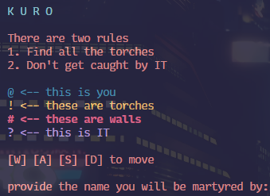

# `kuro`

<div align="center">
    <p>
    Everything is cast in shadow. Something is still chasing you.
    Survive three procedural floors, collect the fire, and break Umbra in the depths.
    </p>
    
</div>

## overview

`kuro` is a terminal-first horror run built in Go.
Version 2 adds:

- a proper title, help, difficulty, seed, death, and victory flow
- reproducible seeded runs
- procedural BSP room-and-corridor levels
- cellular cave floors blended with preserved chambers on deeper runs
- multiple enemy archetypes with wall-aware pathing and sentry alarm behavior
- room-entry encounters with lore, blackouts, gauntlets, shrine rooms, and route revelations
- a final boss floor with telegraphed hazards, multi-phase pressure, summons, and anchor-lighting objectives

## setup

Requirements:

- Go installed locally
- a terminal that supports ANSI color / full-screen terminal apps

```console
$ git clone https://github.com/gongahkia/kuro
$ cd kuro
$ make tidy
```

## run

```console
$ make run
```

## controls

- `W A S D` or arrow keys: move
- `.` or space: wait a turn
- `Enter`: confirm menu choice
- `Esc`: go back in menus
- `Q`: quit

## progression

- Floors 1 and 2: collect every torch on the floor, then use the exit.
- Floor 2 may shift into cave terrain with lore pockets and darker sightlines.
- Floor 3: collect fire, enter the boss room, and light all anchors while surviving Umbra's escalating phases.

## difficulty scaling

- `Apprentice`: smaller maps, more health, lower threat budget
- `Stalker`: balanced default run
- `Nightmare`: larger maps, fewer mistakes allowed, more hostile pacing

Difficulty scales:

- map size
- torch quota
- encounter threat budget
- boss pressure
- procgen density and cave frequency

## seeded runs

- Leave the seed field blank for a random run.
- Enter a numeric seed to replay the same level layout and pacing seed.

## test

```console
$ make test
```

## soak

```console
$ make soak
```
