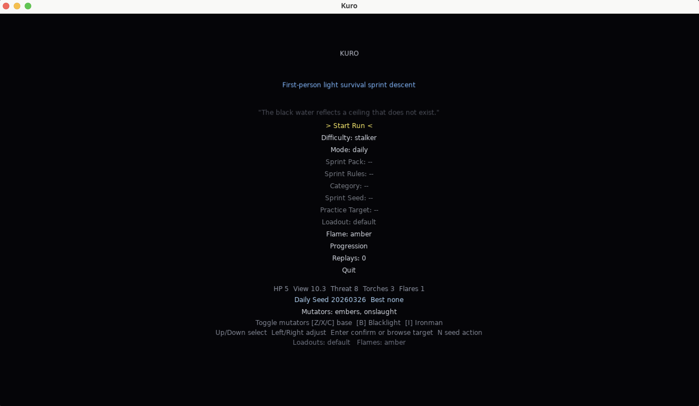
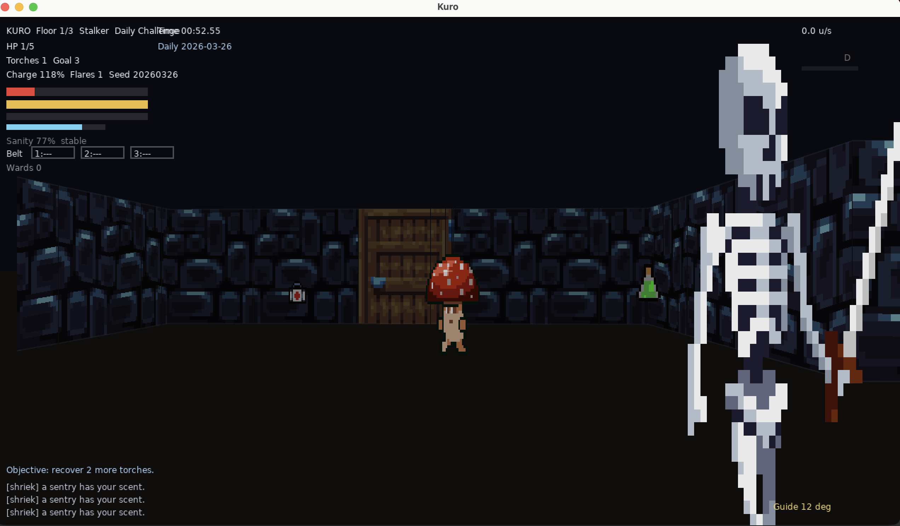
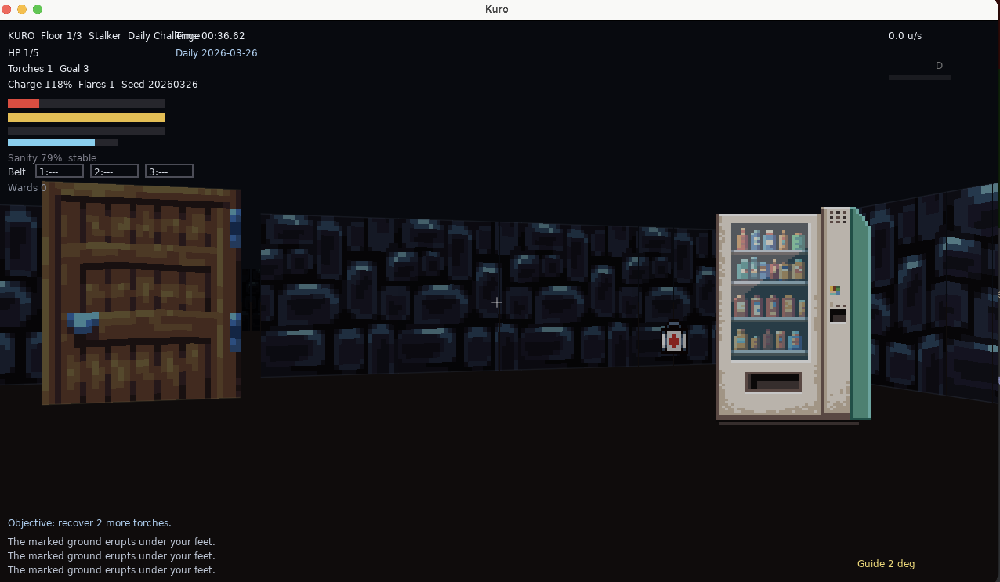
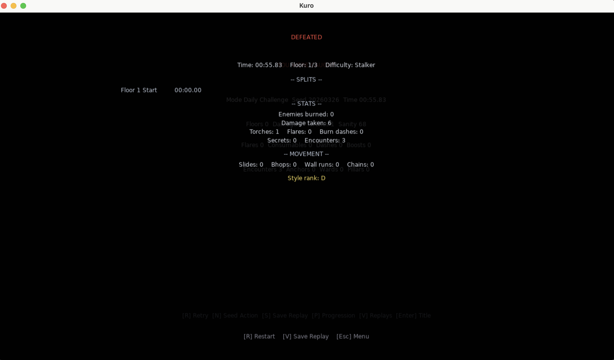

[](https://github.com/gongahkia/kuro/releases/tag/1)
[](https://github.com/gongahkia/kuro/releases/tag/2)

# `Kuro`

[Doom](https://en.wikipedia.org/wiki/Doom_(franchise))-style [speed-runnable](https://steamcommunity.com/discussions/forum/12/1743358239845722603/?l=latam) [roguelike](https://en.wikipedia.org/wiki/Roguelike).

## Usage

```console
$ git clone https://github.com/gongahkia/kuro && cd kuro && brew install love
$ make test
$ make run
```

## Screenshots






## Asset Packs

* [*Pixel Texture Pack*](https://jestan.itch.io/pixel-texture-pack) by Jestan 
* [*Skeletons Pack*](https://monopixelart.itch.io/skeletons-pack) by MonoPixelArt 
* [*Forest Monsters*](https://monopixelart.itch.io/forest-monsters-pixel-art) by MonoPixelArt 
* [*Flying Forest Enemies*](https://monopixelart.itch.io/flying-enemies) by MonoPixelArt 
* [*Crafting Materials*](https://beast-pixels.itch.io/crafting-materials) by Beast Pixels 
* [*Pixel Mart*](https://ghostpixxells.itch.io/pixel-mart) by GhostPixxells 
* [*Pixel Art Vending Machines*](https://karsiori.itch.io/pixel-art-vending-machines) by Karsiori 
* [*Sci-Fi Lab Pick-Ups*](https://foozlecc.itch.io/sci-fi-lab-pick-ups) by Foozle 